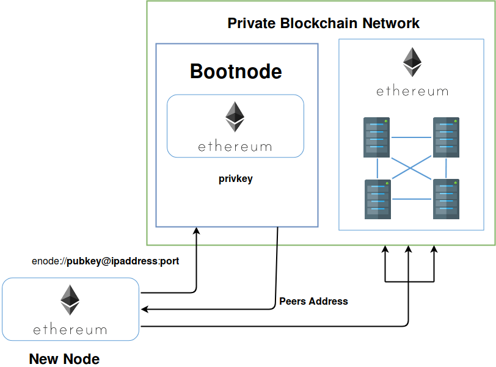

# Herramientas de Ethereum

## Introducción

Este documento detalla como utilizar varias herramientas incluidas en Ethereum.

## Instalación

Todas estas herramientas vienen ya instaladas en el contenedor **docker**, basta con acceder a él

```
docker exec -ti <nombre del contenedor> bash
```

## Bootnode

Se utiliza para facilitar la conexión a la red de nuevos nodos de **Ethereum** mediante la creación de un nodo de referencia.



La herramienta **bootnode** permite generar una clave privada e inferir el **enode** a partir de ella.

### Uso

Creación de clave privada

```
bootnode -genkey bootnode.key

```

En el archivo "bootnode.key" está almacenada la clave que servirá como semilla para generar la clave pública.

> A diferencia de **RSA**, aquí la clave pública se puede inferir a partir de la privada

Creación del **enode**, dirección del **bootnode** que debe ser indicada a cualquier nuevo nodo para que se conecte a él.

```
bootnode -nodekey bootnode.key
```

## Creación de cuentas con Geth

Es muy recomendable crear al menos una cuenta antes de iniciar la red privada. Esta cuenta servirá como **coinbase** y tendrá ya fondos, tabmién se utilizará para desplegar **Smartcontracts**.

### Uso

Ejecutar:

```
geth account new
```

Introducir un password que se utilizará después para desbloquear la cuenta (no se puede recuperar en caso de olvido).

El archivo con la información de la cuenta se generá por defecto en:

```
~/.ethereum/keystore
```

## Puppeth

Se utiliza para generar de forma fácil el bloque de **genesis**.

Hay que tener en cuenta que el bloque de génesis es del que parten todos los nodos de la red y debe ser exactamente igual en todos.

Basta con ejecutar:

```
puppeth
```

Esta herramienta solicita una serie de información para la creación del **genesis**.

1. Nombre de la red cualquiera por ejemplo "prueba"
2. Configurar nuevo genesis (opción número 2)
3. Elegir opción número dos para utilizar "proof of authority" como protocolo de consenso
4. Tiempo que tarda en generarse un bloque (por ejemplo 10)
5. Utilizar el "address" de la cuenta generada en el apartado anterior para firmar
6. Utilizar el "address" de la cuenta generada en el apartado anterior para que tenga fondos
7. ID de la red, un número cualquiera
8. Administrar génesis existente (opción número 2)
9. Exportar configuración del génesis (opción número 2)
10. Nombre del archivo del bloque de génesis (idealmente "genesis.json")
11. Salir de **puppeth** con CTRL+C

Se habrá generado un archivo "*.json" en el directorio en el que se ha ejecutado el comando. 


> Puppeth genera un numero inmenso de cuentas, es recomendable borrarlas todas menos las que se hayan creado a mano.